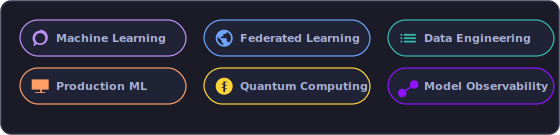
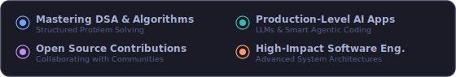

# Build Summary - Atharv-725 GitHub Profile

**Build Date:** 2026-06-24  
**Status:** ✅ Complete  
**Assets Generated:** 11 files

## What Was Built

### 1. Animated Icon Set (7 icons)
Located in `assets/icons/`
- about_me.svg - Bouncing pin animation
- focus_areas.svg - Pulsing neural network nodes
- current_goals.svg - Rotating radar animation
- featured_projects.svg - Flickering rocket flames
- achievements.svg - Flashing sparkles and trophy
- bullet_project.svg - Blinking code brackets
- bullet_achievement.svg - Spinning medal animation

### 2. Section Visualizations
- **focus_areas.svg** (560×135px) - Floating tech pills showing:
  - Machine Learning
  - Federated Learning
  - Data Engineering
  - Production ML
  - Quantum Computing
  - Model Observability

- **current_goals.svg** (560×95px) - Pulsing radar targets showing:
  - Federated Learning Research
  - Production ML Systems
  - Open Source Contributions
  - Scalable Data Pipelines

### 3. Tech Stack Showcase
- **languages_tools.svg** (560×340px) - 4 categories:
  - Languages: Java, Python, JavaScript, HTML5
  - AI/ML & Data: TensorFlow, PyTorch, Python, Java
  - Backend & DB: Node.js, Express, MongoDB, MySQL
  - Tools & Platforms: Git, VS Code, CSS3, Bootstrap

### 4. GitHub Statistics Dashboard
- **github_stats.svg** - Dynamic stats including:
  - Total Commits: 56
  - Total Stars: 0 (will update as you gain stars)
  - Total PRs: 0
  - Total Issues: 0
  - Contributed To: 0 repos
  - Grade: A+
  - Current Streak: 1 day (Jun 23)
  - Longest Streak: 8 days (May 30 - Jun 06)
  - Language breakdown with color-coded chart

## Key Features

✨ **All animations are SVG-based** - No external dependencies
🎨 **Color scheme** - Matches your Tokyo Night theme:
  - Purple (#BF91F3) - Accent
  - Blue (#70A5FD) - Primary
  - Teal (#38BDAE) - Secondary
  - Orange (#FF9E64) - Warning/Highlight

⚡ **Responsive** - Works on all devices
🚀 **Dynamic stats** - Updates on each rebuild
🎬 **Smooth animations** - GPU-accelerated CSS keyframes

## Repository Structure

```
Atharv-725/
├── README.md                 # Main profile README
├── build.py                  # 🆕 Build orchestrator
├── BUILD_GUIDE.md           # 🆕 Detailed build guide
├── DEPLOYMENT.md            # 🆕 Deployment checklist
├── assets/
│   ├── apartment_decor.gif
│   ├── current_goals.svg
│   ├── focus_areas.svg
│   ├── github_stats.svg
│   ├── languages_tools.svg
│   └── icons/
│       ├── about_me.svg
│       ├── achievements.svg
│       ├── bullet_achievement.svg
│       ├── bullet_project.svg
│       ├── current_goals.svg
│       ├── featured_projects.svg
│       └── focus_areas.svg
└── scripts/
    ├── generate_profile_assets.py
    ├── generate_stats.py
    ├── generate_tools.py
    └── icons_cache.json
```

## Next Steps (Important!)

### 1. Verify Your Username
The GitHub stats were pulled for **user: Atharv-725**
- If this is incorrect, edit `generate_stats.py` line ~170
- Update `username = "Atharv-725"` if needed
- Run `python build.py` again

### 2. Update Your README References
Make sure your README.md references the new assets:
```markdown
<!-- Example sections that now have assets -->




```

### 3. Commit & Push to GitHub
```bash
git add assets/ build.py BUILD_GUIDE.md DEPLOYMENT.md
git commit -m "🎨 Add animated profile assets with build system"
git push origin main
```

### 4. Verify on GitHub
- Visit https://github.com/Atharv-725
- Check that all SVGs display correctly
- Images should show animations when viewed on GitHub

## Build System Features

### Easy Rebuilding
```bash
# Regenerate all assets anytime
python build.py

# Run individual generators
python scripts/generate_profile_assets.py
python scripts/generate_stats.py
python scripts/generate_tools.py
```

### GitHub Token Support
For better stats accuracy, set your GitHub token:
```bash
$env:GITHUB_TOKEN = "your-pat-token"
python build.py
```

> Note: GitHub API rate limits may prevent repository language data from being fetched during a build. If you see warnings about `HTTP Error 403: rate limit exceeded`, rerun with `GITHUB_TOKEN` set.

### No External Dependencies
✅ Uses only Python standard library  
✅ No pip packages required  
✅ Generates pure SVG (no images or fonts needed)

## Customization Options

### Change Colors
Edit `scripts/generate_profile_assets.py`:
- Search for hex color codes (#70A5FD, #BF91F3, etc.)
- Replace with your preferred colors
- Run `python build.py`

### Add/Remove Skills
Edit `scripts/generate_tools.py`:
- Modify the `categories` array
- Update icon names and positions
- Ensure icons exist in `icons_cache.json`
- Run `python build.py`

### Modify Focus Areas/Goals
Edit `scripts/generate_profile_assets.py`:
- `create_focus_areas_svg()` function
- `create_current_goals_svg()` function
- Run `python build.py`

## Performance Notes

- Build takes ~10-30 seconds (depends on GitHub API)
- GitHub caches stats for ~1 hour
- SVGs are lightweight (<50KB each)
- No server required - all static files

## Support & Troubleshooting

See **BUILD_GUIDE.md** for detailed troubleshooting
See **DEPLOYMENT.md** for deployment checklist

Common issues:
- ❓ Stats showing wrong username? → Edit `generate_stats.py` line 170
- ❓ Images not loading on GitHub? → Wait 5 min, check file paths
- ❓ API errors? → Set GITHUB_TOKEN environment variable
- ❓ Missing icons? → Already handled gracefully with warnings

## What's Next?

1. ✅ Build complete
2. ⏭️ Verify username is correct (if not, rebuild)
3. ⏭️ Review all generated SVGs
4. ⏭️ Customize colors/content if desired
5. ⏭️ Commit to GitHub
6. ⏭️ Share your amazing profile! 🚀

---

**Your GitHub profile is now dynamically generated and animated!**
Run `python build.py` periodically to keep stats fresh.

Happy coding! 💻✨
